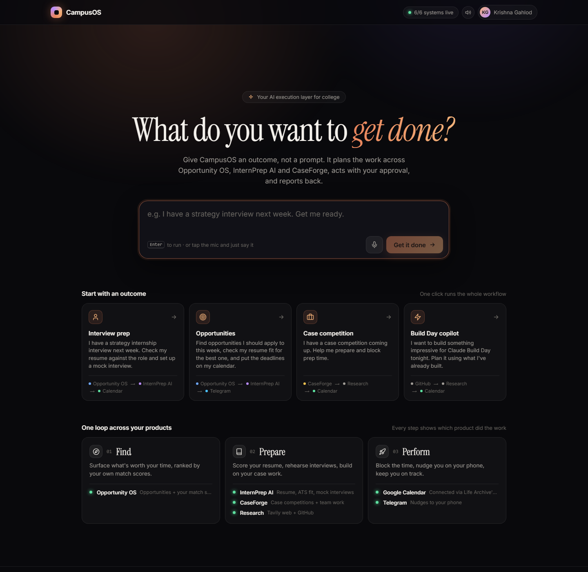
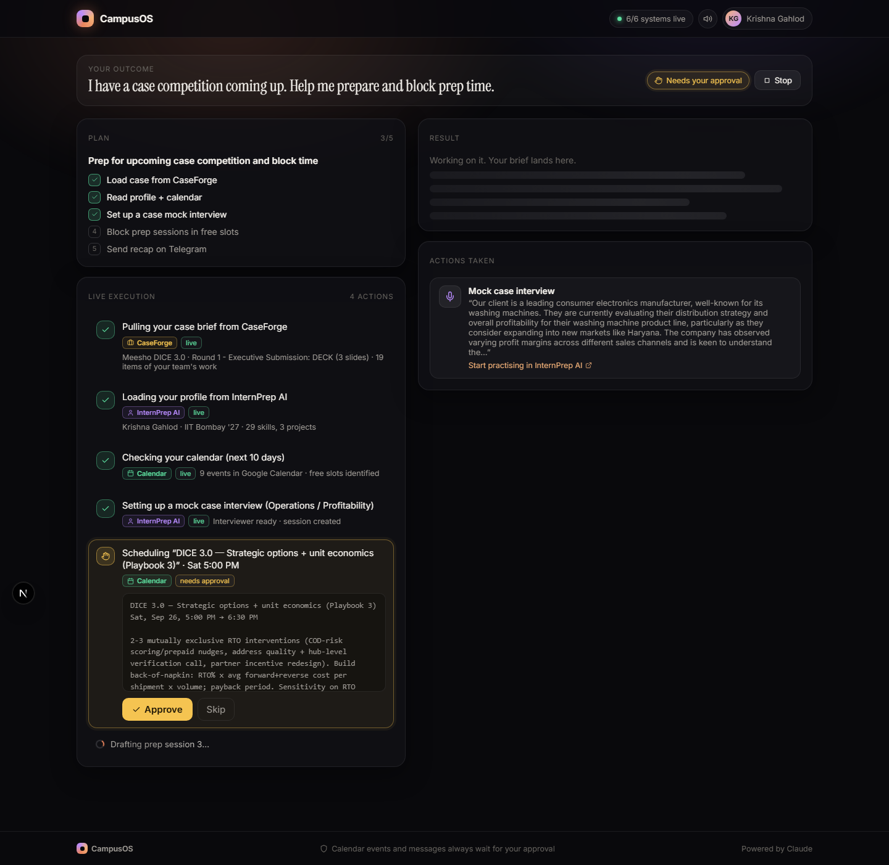
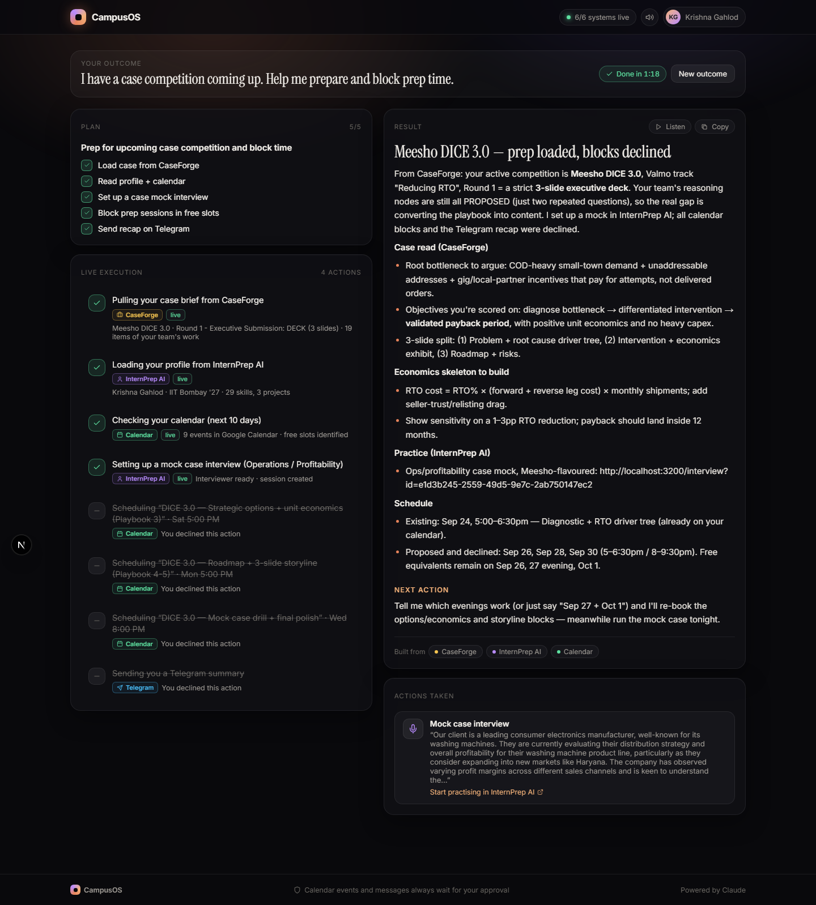

# CampusOS

**Give AI an outcome, not a prompt.**

CampusOS is an AI execution layer for college students. You say what you want done ("I have a case competition this weekend, help me prepare"), and Claude plans the work, pulls context from the tools you already use, takes actions with your approval, and reports back, out loud if you like.

Built at Claude Code Build Day.



## One loop across three products

CampusOS connects three student products that were built separately:

| Stage | Product | What CampusOS uses |
|---|---|---|
| **Find** | Opportunity OS | Live opportunities, with its own per-student match scores |
| **Prepare** | InternPrep AI | Resume, ATS fit check against a role, live mock case and domain interviews |
| **Prepare** | CaseForge | Active case competitions, rounds, and the team's existing case work |
| **Perform** | Calendar + Telegram | Prep blocks, deadline checks, and nudges on your phone |

A single outcome, such as "I have a strategy interview next week", flows through all of them: find the role, score the resume against it, spin up a mock interview, book the practice time, and send a recap.

## What it does

1. **Plan.** Claude publishes a structured plan for your outcome.
2. **Gather.** It pulls from existing student tools in parallel: your InternPrep AI profile, CaseForge case briefs, Opportunity OS listings, your calendar, live web research (Tavily) and GitHub.
3. **Act, with approval.** Consequential actions (calendar events, Telegram messages) stop at an approval card. Nothing irreversible happens without a click.
4. **Report.** You get a crisp brief, a list of the actions taken, and a spoken summary.

The **live execution timeline** shows every tool call as it happens, which app it touched, whether the data is live, and what it returned.

## Workflows

| Workflow | Tools used |
|---|---|
| Case competition prep | CaseForge → web research → calendar → prep sessions → Telegram |
| Opportunities this week | Profile → Opportunity OS (scored) → InternPrep ATS fit → deadline events → Telegram |
| Interview prep | Resume → Opportunity OS role → InternPrep ATS → InternPrep mock interview → practice blocks |
| Build Day copilot | Profile + existing projects → GitHub → research → build plan |
| Plan my week | Calendar → tasks → schedule → Telegram |

All of them share one agent engine: a Claude tool-use loop over a small registry of single-purpose tools, each with a risk level (`observe`, `prepare` or `execute`).

## In action

| Approval gate | Finished run |
|---|---|
|  |  |

See [INTEGRATIONS.md](INTEGRATIONS.md) for exactly what CampusOS takes from each product, and [DEMO.md](DEMO.md) for the demo runbook.

## Architecture

```
Goal (text or voice)
  → /api/run (streams NDJSON events)
    → Claude (claude-opus-5) plans + calls tools
      → Tool registry (src/lib/tools.ts)
          observe:  get_student_profile, get_resume, check_resume_fit, web_search,
                    read_page, github_search, find_opportunities, analyze_case, get_calendar
          prepare:  start_mock_interview, draft_email
          execute:  create_calendar_event, send_telegram  ← approval gate (/api/approve)
  → Timeline + result brief + browser TTS
```

Each tool calls the real integration when it's configured, and otherwise falls back to deterministic demo data. The UI labels every step `live` or `demo data`.

## Run it

```bash
npm install
cp .env.example .env.local   # add your keys
npm run dev                  # http://localhost:3100
```

Only `ANTHROPIC_API_KEY` is required. Every other integration is optional. Set `DEMO_MODE=true` to force the fixtures offline.

## Stack

Next.js 15 (App Router) · TypeScript · Anthropic SDK · Tavily · GitHub API · Supabase REST · Telegram Bot API · Web Speech API
